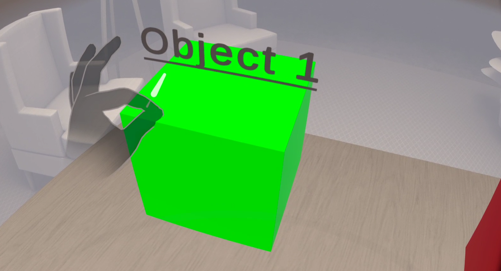
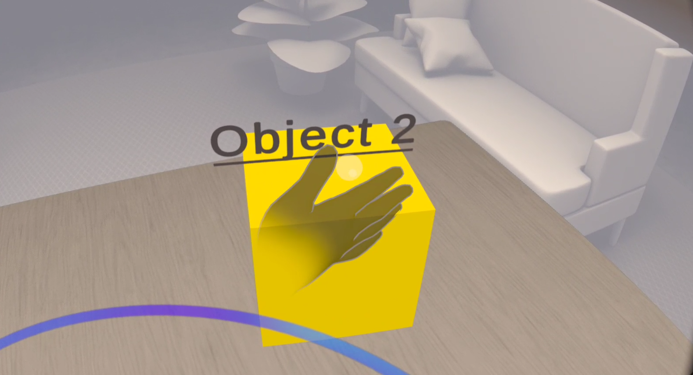
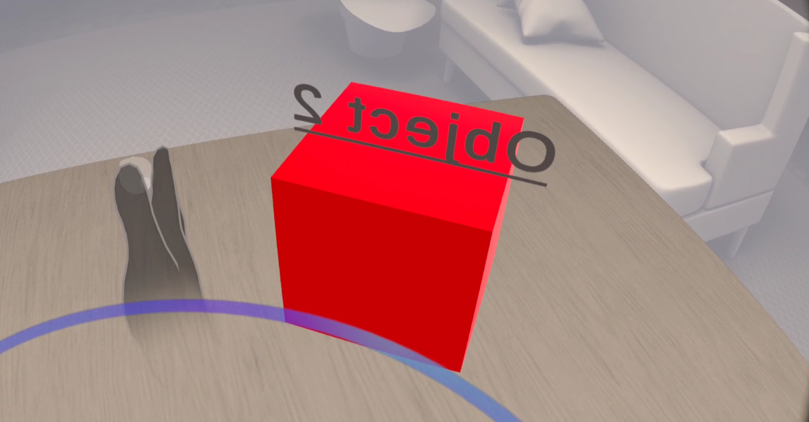

# Gesture-Based Object Interaction

## Overview

This project creates a VR environment where users can interact with objects using hand gestures. The main features include gesture recognition for grabbing and rotating objects, along with visual feedback and an onboarding tutorial.

## Features

### Gesture Recognition
- **Grab Gesture**: Pinch to grab and move objects.
- **Swipe Gesture**: Swipe left or right to rotate objects.

### Interactive Objects
- **Object 1**: Grab and move it.
- **Object 2**: Swipe left or right to rotate.

### Visual Feedback
- Objects Change color when ready for interaction.

### Onboarding Tutorial
- Provides instructions on how to perform gestures when the scene starts.

## Tools Used
- **Unity 3D**
- **C# scripting**
- **Meta XR SDK**

## How to Use
1. **Start the Scene**: Follow the tutorial instructions displayed at the beginning.
2. **Grab Gesture**: Pinch to grab and move **Object 1**.
3. **Swipe Gesture**: Swipe left or right to rotate **Object 2**.

## Images

Add your images for gestures here:

- **Pinch Gesture**: 
- **Swipe Gesture Begin**: 
- **Swipe Gesture End**: 
  
## 📬 **Contact**  
Developed by **Rohit Bisht** 🚀  
- 📧 Email: [rbisht882@gmail.com](mailto:rbisht882@gmail.com)  
- 🌐 Connect with me for more awesome projects!  

---

### ⭐ **If you enjoy the project, don’t forget to star the repo!**  
